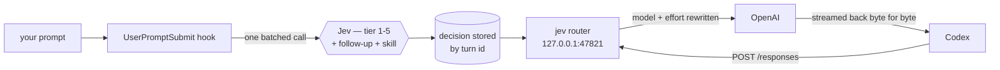

# jevify

**Stop paying flagship prices to rename a variable.**

Your coding agent sends every prompt to the same expensive model — the one-line fix, the "what does this function do", and the genuinely hard refactor all cost the same. jevify decides *per prompt* how much model the work actually needs, and routes accordingly.

The decision is made by [Jev](https://typesafe.ai) (TypeSafe System One), a classifier that answers in ~0.4s and costs about $0.042 per million input tokens — billed outside your plan, so the classification itself never eats your usage.

```
jev → gpt-6-luna · low (tier 1, 0.99)
```

Works with **Codex** (the ChatGPT desktop app) and **Claude Code**.

---

## Measured

From one developer's real working sessions, not a benchmark:

| | Result |
|---|---|
| Whole session, 225 requests | **59% fewer credits** |
| A single routed turn (8 requests, 118K context) | **97–99% fewer credits** |
| Corrections after routed turns | **0 of 9** |
| Corrections after unrouted turns | 3 of 10 |
| Prompt cache hit rate | 94–97% |
| Claude Code, same 5 prompts, Opus → Sonnet | **$1.12 → $0.49** |

**Read that quality row carefully.** Routed and unrouted turns aren't a fair comparison: a turn is only routed when Jev classifies it *confidently*, and confidently-classifiable prompts tend to be clearly-specified ones. The honest claim is **no detectable degradation from routing**, not that routing improves output.

---

## What it does

| Lever | What happens | Default |
|---|---|---|
| **Model router** | Jev scores each prompt 1–5; a localhost proxy rewrites the model on the wire | on |
| **Tool-call gate** | Flags re-reads of unchanged files and repeated searches | shadow |
| **Output trimmer** | Shrinks huge tool outputs before they reach the model (Codex) | on |
| **Skill router** | Picks the right skill for the prompt instead of listing them all | on |
| **Graph code search** | `jev_search` over a Graphify index of your repo | on |
| **Meter** | `/jev` reports credits, savings, cache hits and correction rate | — |

Everything **fails safe**: if Jev is unreachable, the key is wrong, or the proxy is down, your turn runs exactly as it would without the plugin.

---

## How routing works



The default ladder, and what each rung costs per million tokens in Codex credits:

| Tier | Work | Model | Input / Cached / Output |
|---|---|---|---|
| 1 | Trivial — a question, a rename, a one-line change | `gpt-6-luna` · low | 2.5 / 0.25 / 12.5 |
| 2 | Routine — a small feature, tests, a clear bug fix | `gpt-6-luna` · high | 2.5 / 0.25 / 12.5 |
| 3 | Moderate — multi-file changes needing judgment | `gpt-6-sol` · high | 50 / 5 / 250 |
| 4 | Hard — tricky debugging, cross-cutting design | `gpt-6-astra` · high | 250 / 25 / 1250 |
| 5 | Hardest — novel algorithms, high-stakes changes | `gpt-6-astra` · xhigh | 250 / 25 / 1250 |

Below 0.60 confidence it doesn't route at all and you stay on whatever you picked.

**Prompt caching is protected**, which matters more than it sounds: switching models means starting a fresh cache, and re-reading a 100K conversation uncached can cost more than the cheaper model saves.

- A **cache guard** prices the switch before taking it, and stays put when the maths doesn't work.
- Effort changes on the same model use a positional `configuration_update` item, so the request-level effort — part of the cache key — never changes.
- Failed rewrites fall back through an ordered ladder ending at your untouched request, so a rejected model costs one retry, not a broken turn.

---

## Install — Codex (ChatGPT app)

```bash
codex plugin marketplace add codebooker/jevify
codex plugin add jev@jevify
```

Restart the app and **trust the six hooks** when prompted. That alone gives you the trimmer, the skill router and the meter.

For model routing, add your Jev key and install the proxy:

```bash
JEV=$(ls -d ~/.codex/plugins/cache/*/jev/*/ | tail -1)
printf 'OPENROUTER_API_KEY=%s\n' "$YOUR_KEY" > /tmp/jev.env   # or TYPESAFE_API_KEY=
python3 "$JEV/scripts/setup.py" key --env-file /tmp/jev.env && rm /tmp/jev.env
python3 "$JEV/scripts/codex_router.py" install
```

Restart the app once more. `/jev` should report `Router: installed and running on :47821`.

A key from either [TypeSafe](https://typesafe.ai) (`TYPESAFE_API_KEY`) or [OpenRouter](https://openrouter.ai) (`OPENROUTER_API_KEY`) works. It's stored at `~/.codex/jev/credentials`, mode `600`, and never leaves your machine except to the Jev endpoint.

## Install — Claude Code

```bash
claude plugin marketplace add codebooker/jevify
claude plugin install jev@jevify
```

```bash
JEV=$(ls -d ~/.claude/plugins/cache/*/jev/*/ | tail -1)
printf 'OPENROUTER_API_KEY=%s\n' "$YOUR_KEY" > /tmp/jev.env
python3 "$JEV/scripts/setup.py" key --env-file /tmp/jev.env && rm /tmp/jev.env
```

There's no proxy on the Claude side — the desktop app ignores `ANTHROPIC_BASE_URL`, so routing works by delegating cheap work to Haiku and Sonnet subagents (`jev:scout`, `jev:helper`, `jev:worker`) instead of rewriting requests.

## Optional — code search

`jev_search` needs a one-time virtualenv (requires [uv](https://docs.astral.sh/uv/)):

```bash
python3 "$JEV/scripts/setup.py" venv check
```

The index builds in the background at session start and lives in `~/.codex/jev/index`.

---

## Commands

| | |
|---|---|
| `/jev` | status, credits, savings, cache hits, corrections |
| `/jev route off \| shadow \| on` | model routing (`shadow` decides and reports without applying) |
| `/jev gate off \| shadow \| on` | tool-call gate |
| `/jev gate` | what the gate would have blocked, last 7 days |
| `/jev trim on \| off` | output trimmer |
| `/jev skills on \| off` | skill router |
| `/jev viewer <url> \| off` | send Jev calls through a local viewer (loopback only) |
| `/jev on \| off` | everything |

Commands are answered by the hook itself and **never reach the model**, so they cost zero tokens.

---

## What it changes on your machine

Installing the router is the only part that touches your setup:

- `~/.codex/config.toml` — sets `openai_base_url` to the local proxy and `enable_request_compression = false` (zstd-compressed bodies can't be rewritten). Both lines are tagged `# jev-router`, previous values are recorded, and a backup is written to `config.toml.jev-backup`.
- `~/Library/LaunchAgents/com.jev.codex-router.plist` — a KeepAlive agent running the proxy.
- `~/.codex/jev/` — settings, credentials, session state, logs, search index.

The proxy binds to `127.0.0.1` only, forwards your auth header untouched over TLS, and logs models and token counts — never headers, bodies or keys.

While it's installed the proxy sits on the critical path. If it can't start, Codex can't reach the API until you uninstall:

```bash
python3 "$JEV/scripts/codex_router.py" uninstall   # restores config.toml exactly
```

`/jev route shadow` is the softer escape hatch — decisions are shown but not applied, no restart needed.

---

## Requirements

- macOS (the router uses launchd; everything else is portable)
- Python 3.9+ — the standard library only, no runtime dependencies
- A Jev key from TypeSafe or OpenRouter
- `uv`, only for the optional search index

## Caveats

- **Jev classifies your prompt text, not your codebase.** "Fix the login bug" is tier 2 if it's a typo and tier 5 if it's a race condition; it reads the same either way. That's the main source of wrong calls.
- **The tier is chosen once, at prompt time.** A turn that starts routine and turns out to be hard stays where it started.
- **Model names and credit rates are configuration**, in `~/.codex/jev/settings.json` (`codex_tiers`, `rates`). When new models ship, update those two.
- **The gate ships in shadow mode** on purpose. Let it show you what it would block before you let it block anything.
- The numbers above come from one person's sessions on one machine. Your mileage will genuinely vary.

## Development

```bash
cd plugins/jev && python3 -m unittest discover -s tests
```

145 tests, no dependencies beyond the standard library. Hook outputs are validated against Codex's own published JSON schemas.

## License

AGPL-3.0
